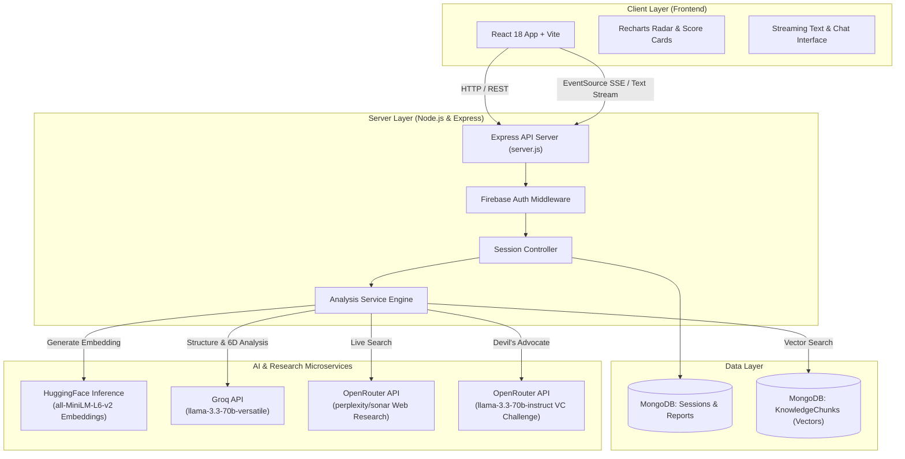
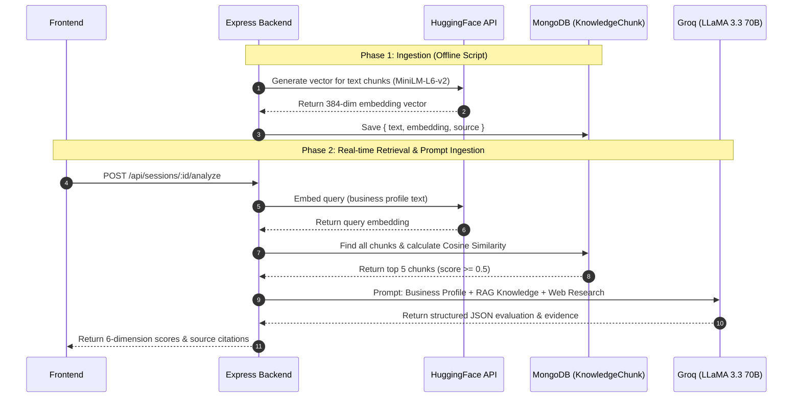
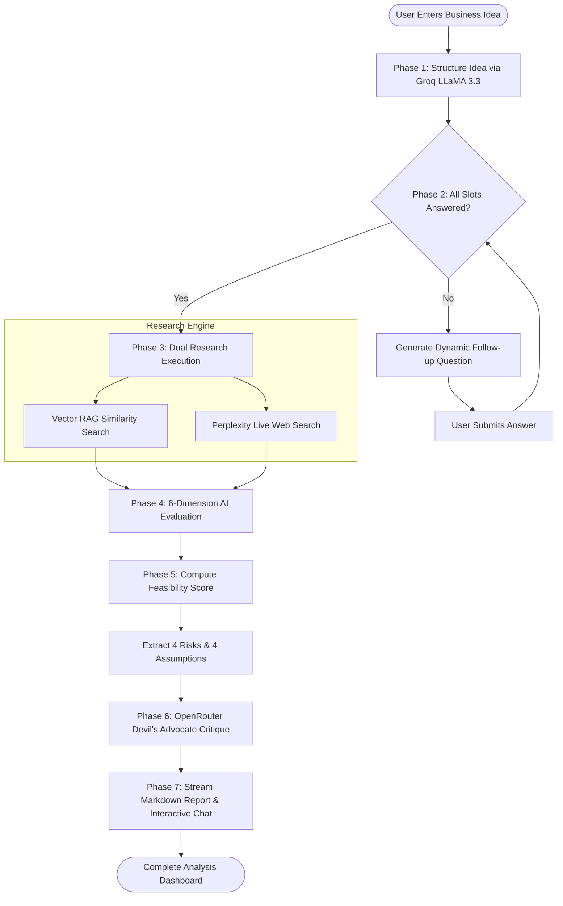

# 🚀 VentureLens — AI-Powered Business Idea Validation Platform

<p align="center">
  <b>Transforming raw business ideas into data-backed startup feasibility reports using multi-stage AI reasoning, vector-based RAG, live market intelligence, and adversarial VC critiques.</b>
</p>

---

## 📌 Table of Contents
- [✨ Key Features](#-key-features)
- [🏗️ System Architecture](#️-system-architecture)
- [🧠 Deep Dive: Retrieval-Augmented Generation (RAG)](#-deep-dive-retrieval-augmented-generation-rag)
  - [1. Knowledge Ingestion & Chunking Strategy](#1-knowledge-ingestion--chunking-strategy)
  - [2. Vector Embedding & Storage](#2-vector-embedding--storage)
  - [3. Cosine Similarity Reranking](#3-cosine-similarity-reranking)
  - [4. Dual-Context Prompt Ingestion](#4-dual-context-prompt-ingestion)
- [⚡ How RAG Enhances Model Performance](#-how-rag-enhances-model-performance)
- [🔄 End-to-End Execution Pipeline](#-end-to-end-execution-pipeline)
- [📊 6-Dimensional Feasibility Scoring Model](#-6-dimensional-feasibility-scoring-model)
- [🛠️ Tech Stack & Model Infrastructure](#️-tech-stack--model-infrastructure)
- [🚀 Quick Start & Setup Guide](#-quick-start--setup-guide)

---

## ✨ Key Features

- **💡 Dynamic Idea Structuring**: Converts unorganized user text into structured JSON venture parameters using LLaMA 3.3 70B via Groq.
- **💬 Interactive Adaptive Interview**: Asks targeted, slot-filling follow-up questions to clarify target customer, monetization, and geography.
- **📚 Domain-Specific Vector RAG**: Grounds evaluation in 10 foundational venture capital frameworks (Porter's Five Forces, TAM/SAM/SOM, Unit Economics, etc.).
- **🌐 Real-Time Web Research**: Queries Perplexity (`sonar`) for live market sizing, growth stats, and competitor insights.
- **🎯 6-Dimensional AI Analysis**: Scores Market Opportunity, Problem Clarity, Revenue Model, Competition, Founder Fit, and Risk Level.
- **😈 Devil's Advocate VC Challenge**: Generates unsparing, realistic critique pointing out critical points of failure.
- **📄 Streaming Report & Follow-up Chat**: Streams a full markdown feasibility report and provides an interactive context-aware chatbot.

---

## 🏗️ System Architecture

The following diagram illustrates how the React frontend, Express API server, MongoDB database, and external AI service APIs interact:



---

## 🧠 Deep Dive: Retrieval-Augmented Generation (RAG)

Standard Large Language Models (LLMs) often provide generic, overly optimistic feedback when evaluating business concepts. **VentureLens implements vector-based RAG** to inject domain-specific venture capital frameworks into the LLM's context window before generation.



### 1. Knowledge Ingestion & Chunking Strategy

The repository includes **10 curated venture capital knowledge base documents** in `backend/data/knowledge-base/`:

| File Name | Topic Covered |
| :--- | :--- |
| `business-model-canvas.txt` | Key partners, value propositions, customer relationships, revenue streams |
| `porters-five-forces.txt` | Competitive rivalry, buyer power, supplier power, threat of substitution/entry |
| `tam-sam-som-methodology.txt` | Total Addressable Market, Serviceable Addressable Market, Serviceable Obtainable Market |
| `unit-economics-basics.txt` | LTV, CAC, payback period, gross margin analysis |
| `startup-failure-modes.txt` | Top causes of startup failure, cash burn, market misfits |
| `revenue-model-types.txt` | Subscription, transactional, marketplace, freemium, licensing models |
| `market-sizing-guide.txt` | Top-down vs. bottom-up market sizing calculations |
| `india-startup-ecosystem.txt` | Tier 1/2/3 demographics, UPI penetration, regional consumer behavior |
| `b2b-vs-b2c-validation.txt` | Enterprise sales cycles vs. consumer acquisition funnels |
| `customer-discovery-methods.txt` | Mom Test principles, interview techniques, pain-point scoring |

> [!NOTE]
> **Chunking Configuration (`chunkText.js`)**:
> - **Chunk Size**: `250 words`
> - **Overlap Size**: `40 words` (preserves sentence context across sliding window bounds)

### 2. Vector Embedding & Storage

Each text chunk is converted into a **384-dimensional dense vector space** using HuggingFace Inference API (`sentence-transformers/all-MiniLM-L6-v2`):

$$\vec{v} = \text{MiniLM-L6-v2}(\text{chunk\_text}) \in \mathbb{R}^{384}$$

Chunks are indexed idempotently into MongoDB with the following Mongoose schema (`rag.service.js`):

```typescript
interface KnowledgeChunk {
  chunkId: string;     // e.g., "porters-five-forces.txt-2"
  source: string;      // e.g., "porters-five-forces.txt"
  text: string;        // The raw chunk string (250 words)
  embedding: number[]; // 384 float numbers
}
```

### 3. Cosine Similarity Reranking

During analysis execution, the system builds an `ideaText` vector from the business profile and computes the Cosine Similarity against all stored chunks:

$$\text{Similarity}(\vec{A}, \vec{B}) = \frac{\vec{A} \cdot \vec{B}}{\|\vec{A}\| \|\vec{B}\|} = \frac{\sum_{i=1}^{n} A_i B_i}{\sqrt{\sum_{i=1}^{n} A_i^2} \sqrt{\sum_{i=1}^{n} B_i^2}}$$

- **Relevance Threshold**: Chunks with score `< 0.5` are discarded.
- **Top-K Selection**: Top **5 highest scoring chunks** are formatted for context injection.

### 4. Dual-Context Prompt Ingestion

VentureLens combines **static framework RAG context** with **dynamic live web research**:

```
┌─────────────────────────────────────────────────────────────────────────────┐
│                            LLM PROMPT INGESTION                             │
├─────────────────────────────────────────────────────────────────────────────┤
│  [1] USER BUSINESS PROFILE                                                  │
│      Product: B2B SaaS | Target: SMBs | Market: India                        │
│                                                                             │
│  [2] RAG KNOWLEDGE CONTEXT (Retrieved Top-5 Vector Chunks)                  │
│      • [porters-five-forces.txt]: Threat of new entrants evaluation...      │
│      • [unit-economics-basics.txt]: SaaS payback target under 12 months... │
│                                                                             │
│  [3] WEB RESEARCH CONTEXT (Live Perplexity Sonar Data)                      │
│      • [Market Size 2024]: Indian B2B SaaS spending reached $13B in 2024...  │
└─────────────────────────────────────────────────────────────────────────────┘
```

---

## ⚡ How RAG Enhances Model Performance

> [!TIP]
> **Why pure LLMs fail at business validation, and how RAG fixes it:**

| Challenge | Standard LLM behavior | VentureLens RAG Behavior |
| :--- | :--- | :--- |
| **Hallucination** | Invented market assumptions & vague advice | Anchored directly to published VC formulas & framework data |
| **Domain Precision** | Generic global business advice | Region-specific metrics (e.g. Indian Tier-2 payment behavior) |
| **Source Citation** | Cannot provide verifiable evidence | Direct source citations (`[porters-five-forces.txt]`) displayed in UI |
| **Token Efficiency** | Dumping entire books causes token overflow | Retains sharp focus by injecting only the top 5 relevant chunks |
| **Evaluation Depth** | Superficial "Great idea!" response | Rigorous, framework-backed 6-dimension scoring matrix |

---

## 🔄 End-to-End Execution Pipeline



---

## 📊 6-Dimensional Feasibility Scoring Model

VentureLens computes an overall feasibility score out of 100 based on a weighted mathematical formula (`scoring.service.js`):

$$\text{Feasibility Score} = \sum_{d \in D} (S_d \times W_d)$$

```
                                  Market Opportunity (20%)
                                          ▲
                                          │
                   Risk Score (25%) ──────┼────── Problem Clarity (15%)
                   (Inverted: 100 - Risk) │
                                          │
                     Founder Fit (10%) ───┼─── Revenue Model (15%)
                                          │
                                          ▼
                                  Competition (15%)
```

### Weighting Breakdown:
1. **Market Opportunity ($20\%$)**: Market size, timing, growth trajectory, demand signals.
2. **Problem Clarity ($15\%$)**: Definition of pain point, urgency, target user segment.
3. **Revenue Model ($15\%$)**: Monetization mechanism, pricing sustainability, LTV:CAC potential.
4. **Competition ($15\%$)**: Market saturation, defensive moat, competitor positioning.
5. **Founder Fit ($10\%$)**: Technical execution capacity, domain expertise, unfair advantage.
6. **Risk Factor ($25\%$)**: Evaluates severity of operational, market, and regulatory risks (Calculated as $100 - \text{Risk Score}$).

---

## 🛠️ Tech Stack & Model Infrastructure

| Layer | Technology / Service | Specific Role & Functionality |
| :--- | :--- | :--- |
| **Frontend UI** | **React 18 + Vite** | Single-Page Application, custom dark-mode theme |
| **Visualizations** | **Recharts** | Radar chart representation of the 6 analysis dimensions |
| **Backend Server** | **Node.js + Express** | RESTful routing, Server-Sent Events (SSE), error handling |
| **Database** | **MongoDB Atlas + Mongoose** | Persistent storage for Sessions, Reports, and Vector Chunks |
| **Authentication** | **Firebase Auth** | User authentication, token validation, session security |
| **Primary LLM** | **Groq (`llama-3.3-70b-versatile`)** | Fast JSON idea structuring, 6D evaluation, report generation |
| **Embedding Engine** | **HuggingFace (`MiniLM-L6-v2`)** | 384-dimensional dense vector embeddings |
| **Live Web Search** | **OpenRouter (`perplexity/sonar`)** | Real-time numeric data research (market size, stats) |
| **Devil's Advocate** | **OpenRouter (`llama-3.3-70b-instruct`)** | Skeptical, unsparing VC pitch critique |

---

## 🚀 Quick Start & Setup Guide

### 1. Prerequisites
- Node.js 18+ installed
- MongoDB instance (Local or Atlas)
- API Keys: `GEMINI_API_KEY`, `GROQ_API_KEY`, `OPENROUTER_API_KEY`, `HF_API_KEY`

### 2. Environment Setup
Create a `.env` file in the `backend/` directory:

```env
PORT=5000
MONGODB_URI=mongodb://localhost:27017/venturelens
GEMINI_API_KEY=your_gemini_key
GROQ_API_KEY=your_groq_key
OPENROUTER_API_KEY=your_openrouter_key
HF_API_KEY=your_huggingface_key
FIREBASE_PROJECT_ID=your_firebase_project_id
FIREBASE_CLIENT_EMAIL=your_firebase_client_email
FIREBASE_PRIVATE_KEY=your_firebase_private_key
```

### 3. Ingest Knowledge Base (Run Once)
```bash
cd backend
node scripts/ingestKnowledgeBase.js
```

### 4. Start Server & Client
```bash
# Terminal 1: Backend
cd backend
npm run dev

# Terminal 2: Frontend
cd frontend
npm run dev
```

---

<p align="center">
  <b>VentureLens</b> — Validating business concepts with precision, evidence, and AI intelligence.
</p>
